# ARMssembly 0
## Approach and steps :
1. After downloading the file chall.S i opened it in vsc.
2. seeing the format it was assembly level language.
3. the assembly language always starts with main function
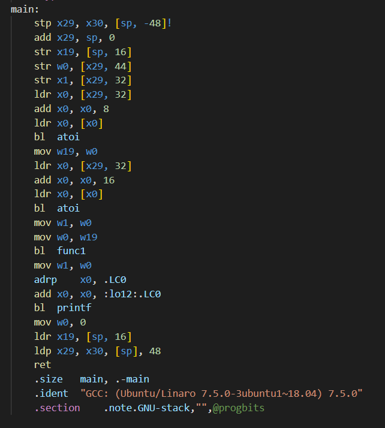
4. fist line stp means store a pair.Its storing x29 and x30 at the address sp(stack pointer)-48 bits.
   
5. second line add is adding sp and 0 and storing it in x29
6. w0 in the 4th line is just 32-bit part of the 64-bit x0 register.
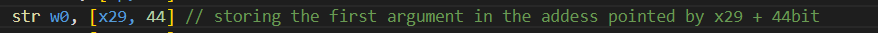
7. 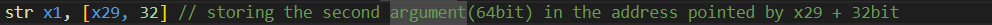
8. 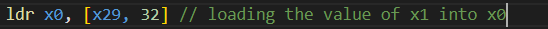
9. 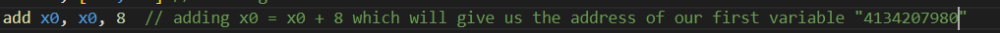
10. 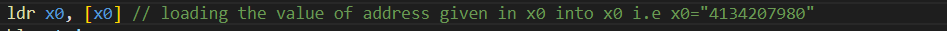
11. 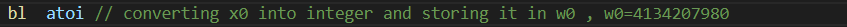
12. 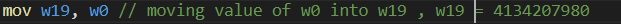
13. 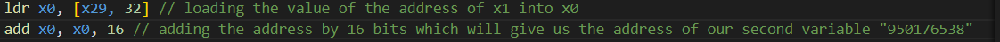
14. 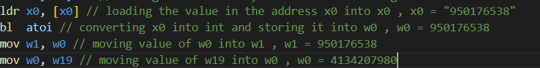
15. 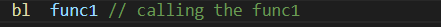
16. 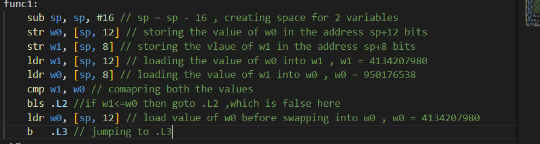
17. 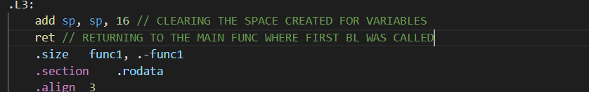
18. 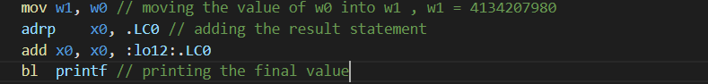
19. we can finalyy see that the ans which is being printed is **4134207980** which translates to hex = **f66b01ec**
20. hence we found the flag.
## Links :
https://www.youtube.com/watch?v=gfmRrPjnEw4

https://www.youtube.com/watch?v=Bt9qhTFWoKg
