# GDB baby step 1
## Approach
1. I am using Linux distribution for this ctf.
2. first i checked the gnu gdb debbuger of my system
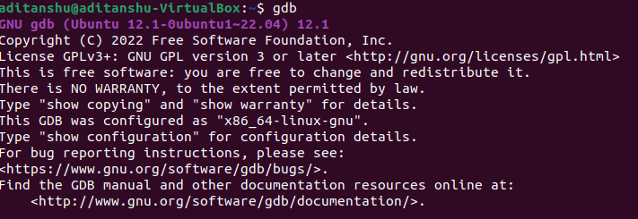
3. Then i downloaded the file by wget.
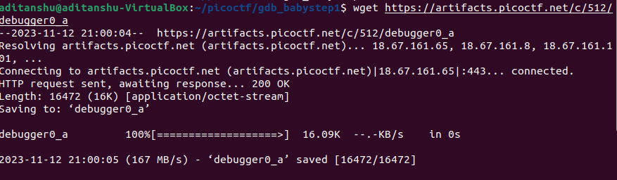
4. then used gdb command on that file.
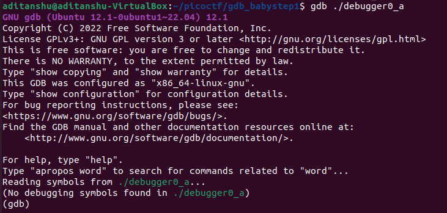
5. then i used info functions to see all the functions.
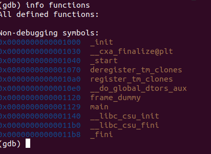
6. then i used lay next to see the assembly level.
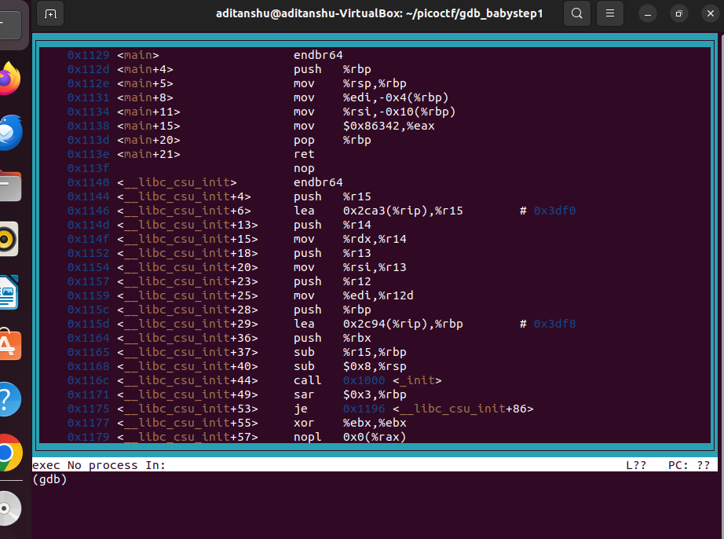
7. after seeing the question i was pretty sure it was something to do with the eax value at the end of the main function.

## Concepts
### GDB
gdb is the acronym for GNU Debugger. This tool helps to debug the programs written in C, C++, Ada, Fortran, etc. The console can be opened using the gdb command on terminal.
To start the debugger of the above gfg executable file, enter the command gdb gfg. It opens the gdb console of the current program, after printing the version information.

#### 1. run [args] : 
This command runs the current executable file. In the below image, the program was executed twice, one with the command line argument 10 and another with the command line argument 1, and their corresponding outputs were printed.
   
#### 2. quit or q : 
To quit the gdb console, either quit or q can be used.
   
#### 3. help : 
It launches the manual of gdb along with all list of classes of individual commands.
   
#### 4. break : 
The command break [function name] helps to pause the program during execution when it starts to execute the function. It helps to debug the program at that point. Multiple breakpoints can be inserted by executing the command wherever necessary. b findSquare command makes the gfg executable pause when the debugger starts to execute the findSquare function.

       b
       break [function name]
       break [file name]:[line number]
       break [line number]
       break *[address]
       break ***any of the above arguments*** if [condition]
       b ***any of the above arguments*** 
   
#### 5. continue : 
This command helps to resume the current executable after it is paused by the breakpoint. It executes the program until it encounters any breakpoint or runs time error or the end of the program. If there is an integer in the argument(repeat count), it will consider it as the continue repeat count and will execute continue command “repeat count” number of times.
   
                        continue [repeat count]
                        c [repeat count]
                
#### 6. next or n : 
   This command helps to execute the next instruction after it encounters the breakpoint.
#### 7. layout next :

displays the code

#### 8. display/[format specifier] [expression] and undisplay [display id1] [display id2] …  : 

These command enables automatic displaying of expressions each time whenever the execution encounters a breakpoint or the n command. The undisplay command is used to remove display expressions. Valid format specifiers are as follows:

                            o - octal
                            x - hexadecimal
                            d - decimal
                            u - unsigned decimal
                            t - binary
                            f - floating point
                            a - address
                            c - char
                            s - string
                            i - instruction
            
#### 9. print : 

This command prints the value of a given expression. The display command prints all the previously displayed values whenever it encounters a breakpoint or the next command, whereas the print command saves all the previously displayed values and prints whenever it is called.

                print [Expression]
                print $[Previous value number]
                print {[Type]}[Address]
                print [First element]@[Element count]
                print /[Format] [Expression]

#### 10. watch <variable_name> : 
to watch a variable for changes

## Steps
1. open the compiled file by :
    
                              gdb ./debbuger0_a

2. write :
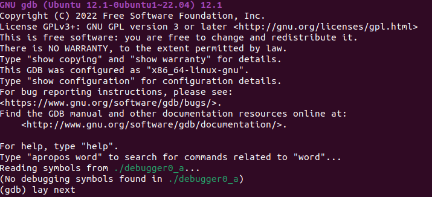

3. set a break point at function __*main*__.
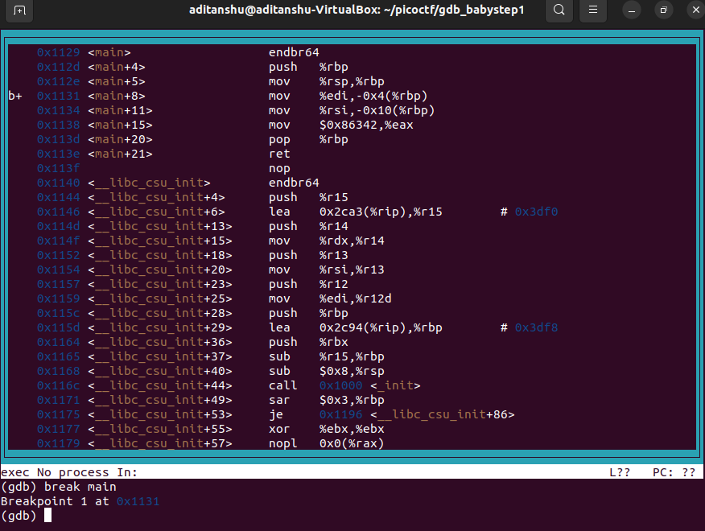

4. run the program by writing **run**.
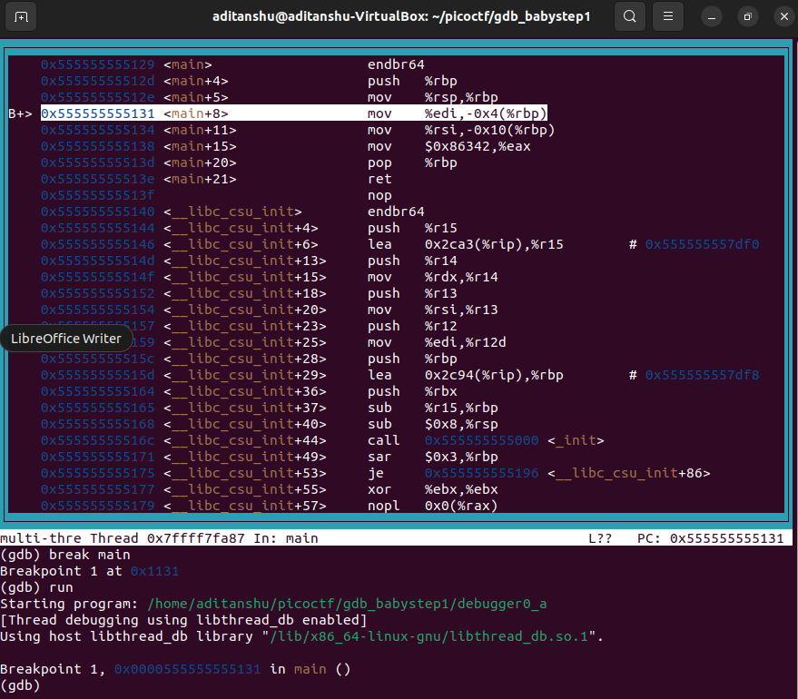

5. by using **nexti** go to the end of the main program.
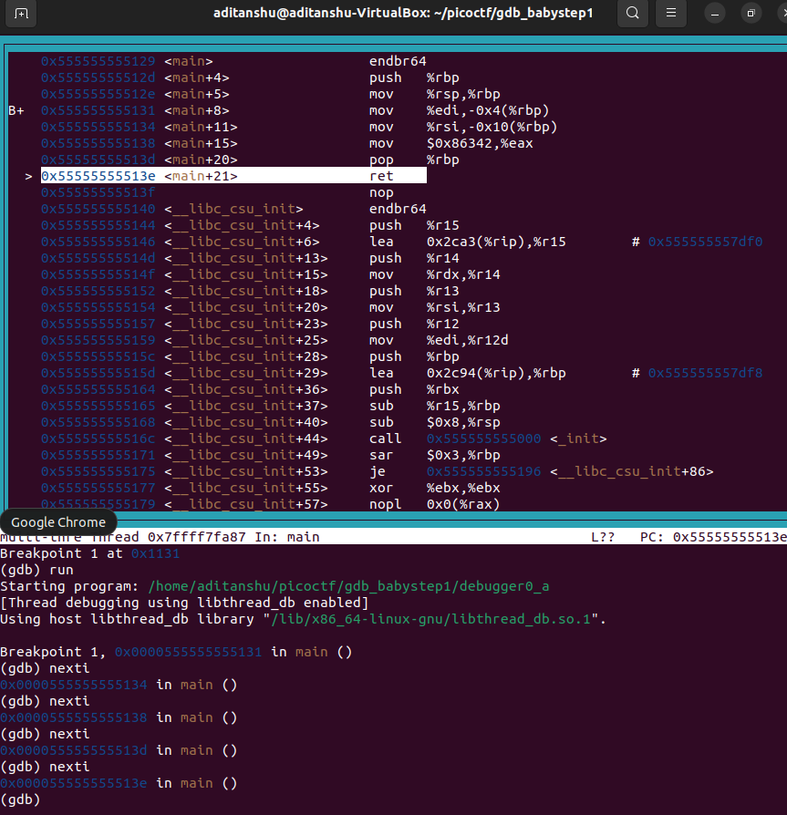

6. set a break point at the end of the __*main*__ function by typing **break**.
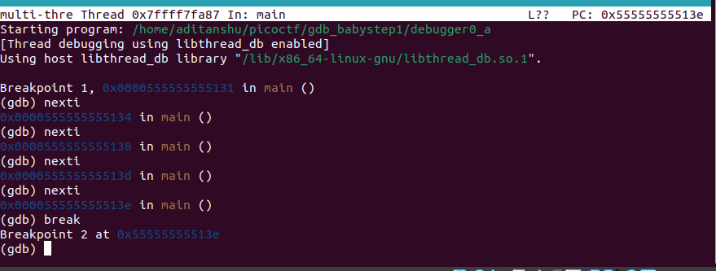

7. set a display command for __eax__ as follows:
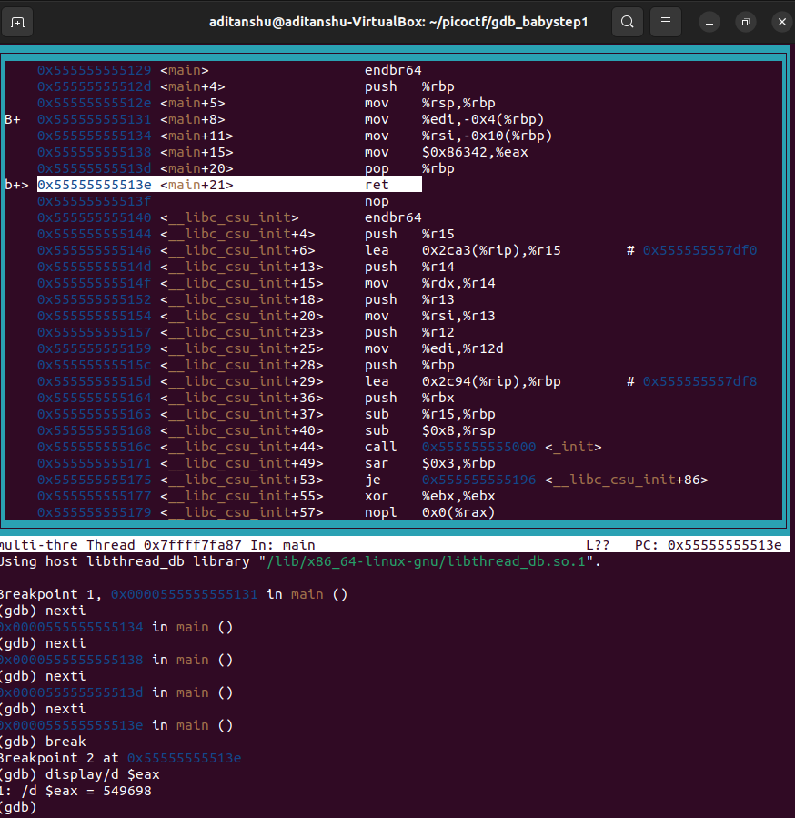

8. run the program and then note the changes in the values of __eax__.
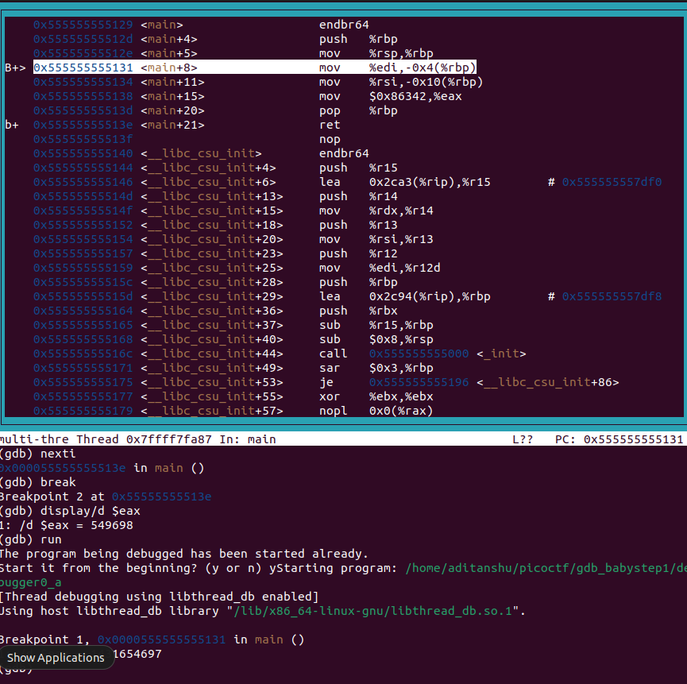

9. to go to the next break point type __next__.
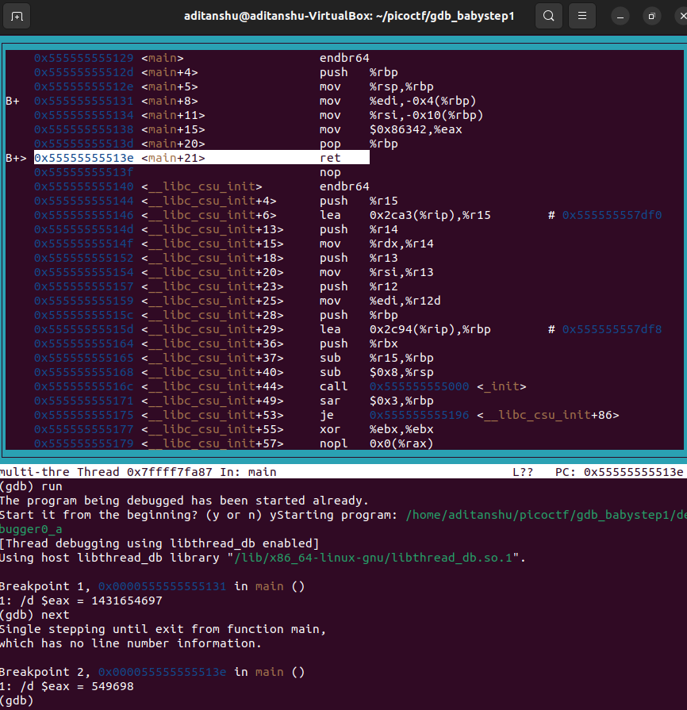

10. note how the value of eax changes.
11. that is our answer as it is displayed in decimal
        
                                 picoCTF{549698}

## REFERENCES
https://visualgdb.com/gdbreference/commands/display

https://www.geeksforgeeks.org/gdb-command-in-linux-with-examples/

https://www.youtube.com/watch?v=Dq8l1_-QgAc
