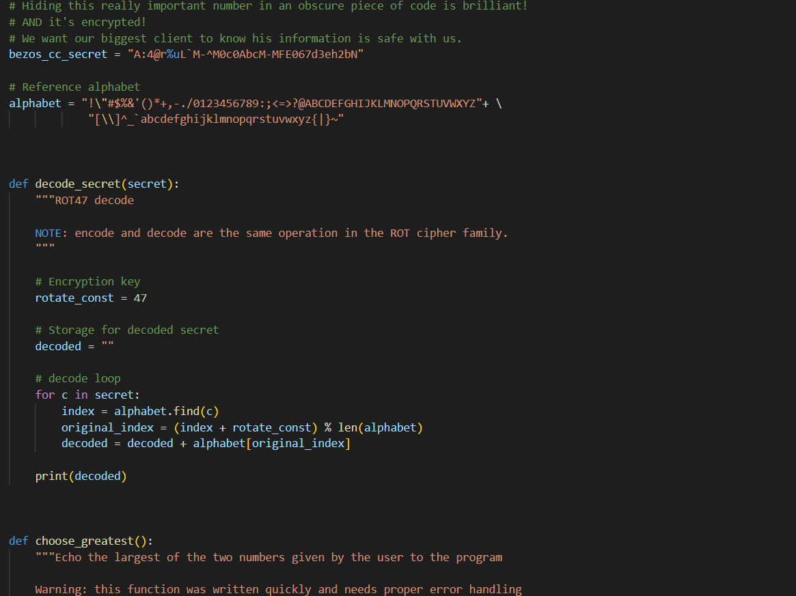
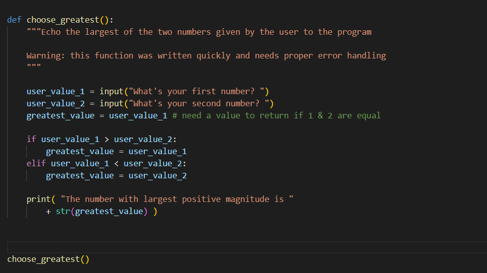
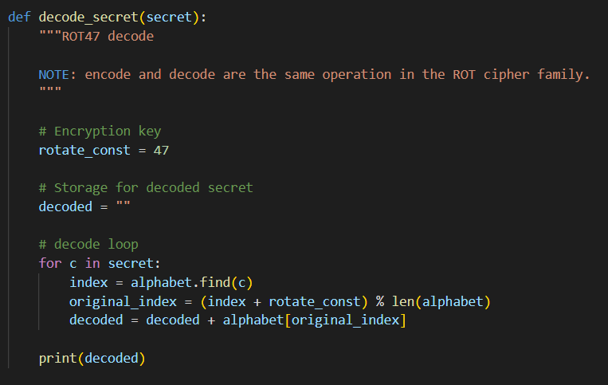
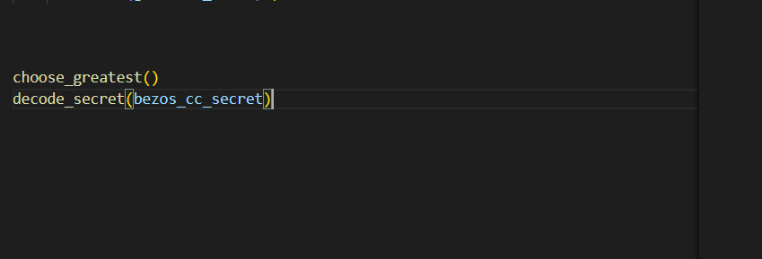
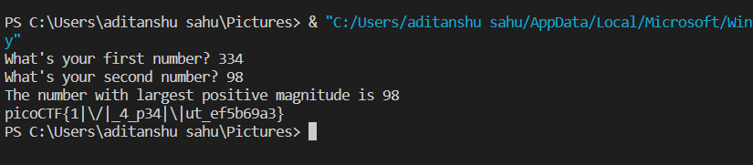

# crackme.py
## Approach
1. after downloading the crackme.py file the code was very easy to decipher.

1. we can here see two functions __decode_secret()__ and __choose_greatest()__ and only one being called at the end:

1. __choose_greatest()__ is a simple compare func which returns the greatest int.
2. upon seeing the __dcode_secret()__ func we can see that its peforming *ROT47* caesar dechiper.

3. it just rotates the character by 47 ascii characters.
4. at the end we can see its printing the decoded string.
5. so we just have to call this func with the secret as the input parameter.

6. after running we get the flag.

## Concepts
### ROT47
The ROT47 (Caesar cipher by 47 chars) is a simple character substitution cipher that replaces a character within the ASCII range [33, 126] with the character 47 character after it (rotation) in the ASCII table. It is an invertible algorithm i.e. applying the same algorithm to the input twice will get the origin text.
## Links
  
https://asecuritysite.com/cipher/rot47