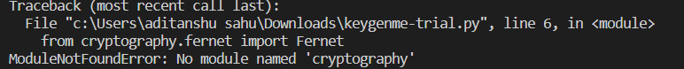
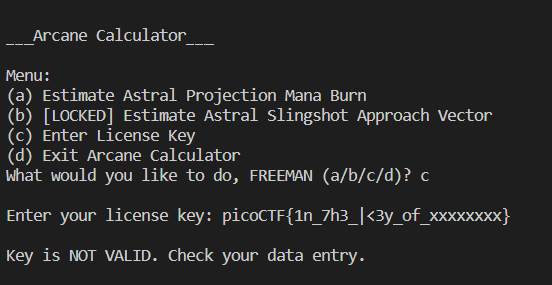
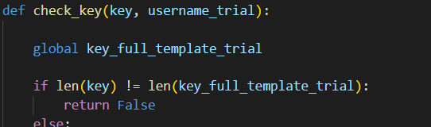
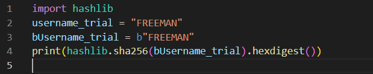
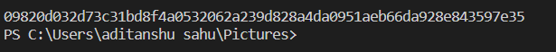
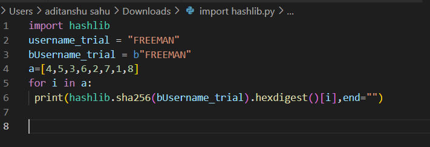
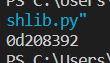
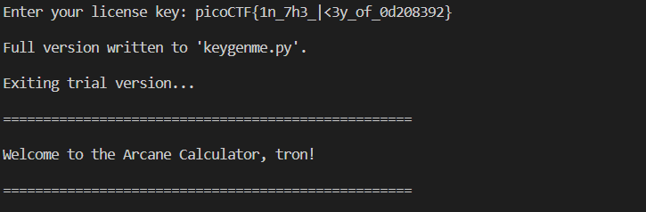

# KEYGENME-PY

## APPROACH

1. Upon execution of keygenme-trial.py i was met with a ModuleNotFoundError

        
    

2. I downloaded the cryptography module.
3. then after running the program again it worked.
4. The only problem it had now the was the wrong key error when entered the key_full_template_trial

    
5. After checking the code it was sure that the function check_key was comparing userkey to key_full_template_trial
   
6. Upon further going down i could see the hashlib values of bytestring "FREEMAN" compared to our key entered.
7. Then i thought it sure must be the xxxxxxxx that are being compared and we need to find the suitable characters to replace the x.

## CONCEPTS
### HASHLIB MODULE
A Cryptographic hash function is a function that takes in input data and produces a statistically unique output, which is unique to that particular set of data. The hash is a fixed-length byte stream used to ensure the integrity of the data. In this article, you will learn to use the hashlib module to obtain the hash of a file in Python. The hashlib module is preinstalled in most Python distributions.

##### a. SHA-256 ALGORITHM
The reason for the usage of SHA-256 is it is one of the most renowned and secure hashing algorithms currently used while offering less time required to compute a hash. The algorithm belongs to the SHA-2 Family, which is succeeded by the SHA-3 family based on sponge construction structure.

    SYNTAX : hashlib.sha256("BYTESTRING").hexdigest()

The above method could also be used to obtain the hash of a finite-length string. For that, the string needs to be converted to a byte stream before it is sent as an argument. For short strings, the process could be accomplished in a single call. The following example demonstrates this in practice:

Firstly a byte literal is initialized and is stored to a variable (due to the b prefix of the string). Then the sha256 function is initialized, and the byte literal is passed as an argument to the update function. This updates the sha256 algorithm with the data. After which, the hash digest is computed, and its hexadecimal equivalent is requested using the hexdigest function. At the end, this hash value is displayed.
### CRPTOGRAPHY MODULE
cryptography is a package which provides cryptographic recipes and primitives to Python developers. Our goal is for it to be your “cryptographic standard library”. It supports Python 3.7+ and PyPy3 7.3.10+.

cryptography includes both high level recipes and low level interfaces to common cryptographic algorithms such as symmetric ciphers, message digests, and key derivation functions.
##### a. FERNET
Fernet guarantees that a message encrypted using it cannot be manipulated or read without the key. Fernet is an implementation of symmetric (also known as “secret key”) authenticated cryptography.

         SYNTAX : f= fernet(key)
##### b. ENCRYPT
         SYNTAX : f.encrypt(data)
Encrypts data passed. The result of this encryption is known as a “Fernet token” and has strong privacy and authenticity guarantees.

    Parameters : data(bytes) - The message you would like to encrypt.

    Returns : bytes - A secure message that cannot be read or altered without the key. It is URL-safe base64-encoded. This is referred to as a “Fernet token”.
##### c. DECRYPT
         SYNTAX : f.decrypt(token,ttl=None)
Decrypts a Fernet token. If successfully decrypted you will receive the original plaintext as the result, otherwise an exception will be raised. It is safe to use this data immediately as Fernet verifies that the data has not been tampered with prior to returning it.

    Parameters : 
    A. token (bytes or str) – The Fernet token. This is the result of calling encrypt().

    B. ttl (int) – Optionally, the number of seconds old a message may be for it to be valid. If the message is older than ttl seconds (from the time it was originally created) an exception will be raised. If ttl is not provided (or is None), the age of the message is not considered.

    Returns bytes : 
    The original plaintext.

# STEPS
1. Open the keygenme-trial.py file
2. Download the crptography module
3. Run the keygenme-trial.py file
4. Create a notepad doc and write **"picoCTF{1n_7h3_|<3y_of_XXXXXXXX}"**
5. Open another python window and write the following:

6. Run the above program and note the output ( Its the hash for the byte string freeman ).

7. Run another program like this:

8. Note its output, its the answer to the xxxxxxxx

9. Replace the xxxxxxxx in **"picoCTF{1n_7h3_|<3y_of_XXXXXXXX}"** by **"0d208392"** and we get our flag.
10. 10. You can check this by entering this value in the "enter license key" menu.

